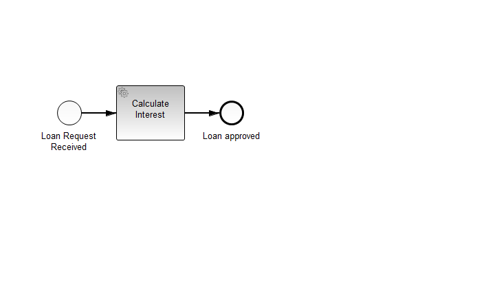

Process Application with java-based configured container
========================================================

This example shows how to configure the container for the process application in Java using `@Configure` and `@Bean`.
It uses the sample application from the spring getting started guide.

The process instance is started after deployment. See implementation of the `org.springframework.beans.factory.InitializingBean` in [Starter](src/main/java/com/camunda/consulting/springexample/Starter.java)

Java 7 and try-with-resource
----------------------------

If you start your project with the `ClassPathXmlApplicationContext` in Java 7, you will often code something like 

    try (ClassPathXmlApplicationContext context = new ClassPathXmlApplicationContext("META-INF/userLibrary.xml")) {
        service = context.getBean(UserLibrary.class);
    }
    
If you change the `ClassPathApplicationContext` to a `AnnotationConfigWebApplicationContext`, the context will not be closed on undeploy and you will get an error that the web application is unable to start again.

To resolve this, remove the try-with-resource statement and everything works fine.

Useful links
------------
[http://docs.spring.io/spring/docs/current/spring-framework-reference/html/beans.html#beans-java](http://docs.spring.io/spring/docs/current/spring-framework-reference/html/beans.html#beans-java)
    